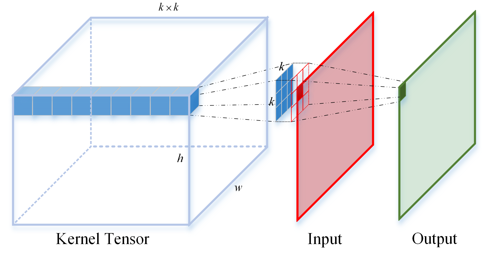
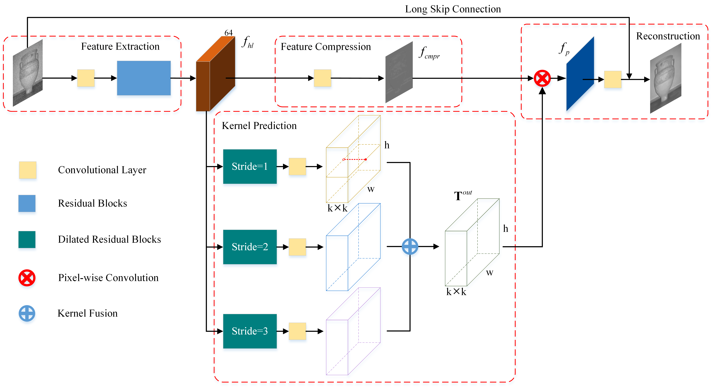

# DKPNet
Code for paper 'Dilated kernel prediction network for single-image denoising'  
--------------------
[paper link](http://dx.doi.org/10.1117/1.JEI.30.2.023021)

Run the **TRAIN/EVAL SCRIPT** to get started!

Pre-trained model files are provided in **./checkpoint/pretrained_models**. 
All three models here are of the standard setting (*kp_size=3*, *n1=9*, *n2=2*), but of different noise levels.
 

NOTICE:
----- 

1. Our work was done in the following environment: Python 3.6.8, Pytorch 1.1.0, cuda 10.0, cudnn 7.6.5.
 
2. We used BSD500 as our training and validation datasets. Remember to change the directory in the script according to your own dataset location. While evaluating, make sure the network setting is consistent with the selected model file.

Quick Introduction
---
We introduce kernel prediction to the single-image denoising task. Instead of predicting the pixel value, we predict unique kernel for each pixel. Some other tricks are also adopted to better adjust the network for the task, such as  dilated convolution, kernel fusion and compressed feature map.

Kernel Prediction:
---

Network Structure:
----

The quantitative results (PSNR) are tested on BSD68 and Kodak24. 
BSD68:

|Noise Level|30|50|70|
|--|--|--|--|
|BM3D|27.76|25.62|24.44|
|TNRD|27.66|25.97|23.83|
|DnCNN|28.36|26.23|24.90|
|MemNet|28.43|26.35|25.09|
|IRCNN|	28.26|26.15|N/A|
|FFDNet|28.39|26.29|25.04|
|DKPNet|28.45|26.36|25.11|

Kodak24:

|Noise Level|30|50|70|
|--|--|--|--|
|BM3D	|29.13	|26.99	|25.73|
|TNRD	|28.87	|27.20	|24.95|
|DnCNN	|29.62	|27.51	|26.08|
|MemNet	|29.72	|27.68	|26.42|
|IRCNN	|29.53	|27.45	|N/A|
|FFDNet	|29.70	|27.63	|26.34|
|DKPNet	|29.78	|27.73	|26.48|

Visual Performance:
-----

---
